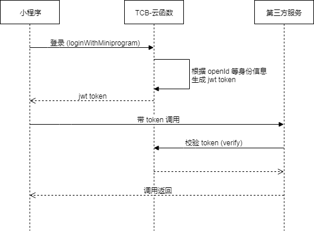

通用小程序登陆 via TCB-云开发
===========================

本云函数试图为小程序第三发服务提供一种通用的登陆验证模式. 原理是利用小程序云开发云函数提供的[天然可信任的用户登陆态](https://developers.weixin.qq.com/miniprogram/dev/wxcloud/basis/capabilities.html#%E4%BA%91%E5%87%BD%E6%95%B0), 通过云开发的云函数调用为自定义登陆以及服务端验证提供功能. 

流程示意图如下



安装
---

TODO

使用
----

客户端登陆: 

```js
wx.cloud.callFunction({
    name: 'auth',
    data: {
        action: 'login',
        data: userInfo
    }
})
```

服务端校验:

```js
this.tcb.callFunction({
    name: 'auth',
    data: {
        action: 'verify',
        token
    }
})
```
